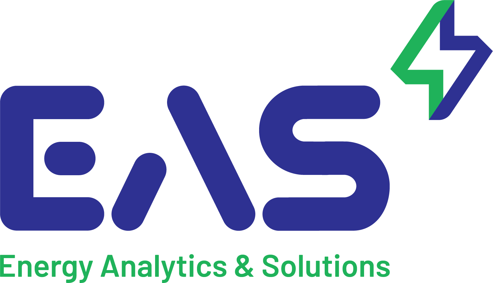

# technical-interview-interns
Technical Interview Question and submission link
Duration: 
60 minutes

## Task: 
Create a simple react app with the EA&S Logo. You are free to use any online resources as long as you do not copy the entire code.

The app should have the following features:

* A display to show elapsed time.
* A start button, a stop button and a reset button.
* EAS logo attached to the application.

For the logo and color palette, please refer to the energyanalyticssolutions.com.

You are welcome to add additional features given that all the three requirements above are fulfilled.

## Conditions:

You are required to share your entire screen at all times while you are working on solving the problem.

Good luck!

### Note:
We will evaluate your performance based on your problem solving skills and the approach that you are taking to arrive at the final solution.
